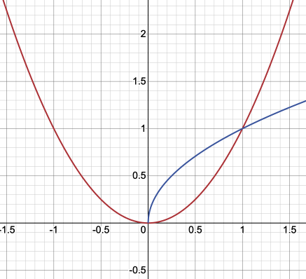
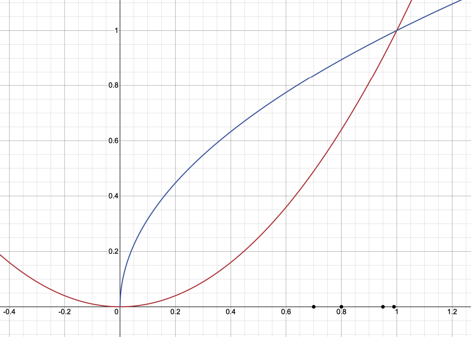
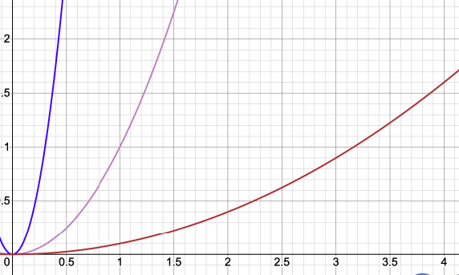

### Произодвная 1
Пусть даны 2-е функции: $ f(t) = \sqrt{t}, g(t) = t^2 $ \
То значения этих функций в токе 1:$f(1) = \sqrt{1} = 1, g(1) = 1^2 = 1$ \
 \

| |t|$$f(t)=\sqrt{t}$$|$$g(t)=t^2$$|
|--|--|--|--|
|t1|0.7|0.837|0.49|
|t2|0.8|0.894|0.64|
|t3|0.9|0.949|0.81|
|t4|0.95|0.975|0.903|
|t5|0.99|0.995|0.980|

 \

Квадратная функция кпри приближении к единице как-будто "ускоряет ход".
Сорость движения - расстояние, деленное на время. 
Пусть t - это время, f(t) - расстояние

Cмотрим разницу в точках $t_2$ и $t_1$, $t_5$ и $t_4$ для $\sqrt{t}$:
$${\sqrt{t_2}-\sqrt{t_1} \over t_2-t_1} = {0.894-0.837 \over 0.8-0.7} = 0.57 $$
$${\sqrt{t_5}-\sqrt{t_4} \over t_5-t_4} = {0.995-0.0.975 \over 0.04} = 0.5 $$

Cмотрим разницу в точках $t_2$ и $t_1$, $t_5$ и $t_4$  для $t^2$:
$${t_2^2-t_1^2 \over t_2-t_1} = {0.64-0.49 \over 0.1} = 1.5 $$
$${t_5^2-t_4^2 \over t_5-t_4} = {0.980-0.903 \over 0.01} = 1.925 $$

Видим, что наши функции по разному реагируют на одинаковые изменения аргумента t.
Парабола растет быстрее, чем "корнева".

Данные вычисления можно записать общим уравнением:
$$f(t+\triangle t)-f(t) \over \triangle t $$

В примере, мы сначала использовали шаг $\triangle t = 0.1$, затем $\triangle t = 0.04$, т.е. уменьшали
промежуток $\triangle t$ на каждом шаге, и если мы продолжен такое уменьшение, то $\triangle t$ у нас будет стремится к нулю. В результате получаем выражение - производную функции в точке t:
$$f'(t) = \lim_{\triangle t \to 0} {f(t+\triangle t)-f(t) \over \triangle t} $$
Таким образом, величина производной в точке показывает мгновенную скорость изменения в ней.

### Производная 2
Запоминаем определение: Производная - это скорость изменения функции. \
Определите, какая из приведенных функций растет бытсрее? \
 \
Ответ - третья. У нее самая большая скорость изменения, то есть самая большая производная.

### Геометрический смысл производной