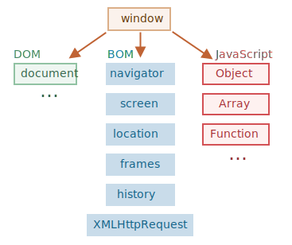

# Браузерное окружение и спецификации

Язык JavaScript изначально был создан для веб-браузеров и превратился в кроссплатформенный язык программирования. Сегодня JavaScript может использоваться в браузере, на веб-сервере или в какой-то другой среде, даже в кофеварке. Каждая среда предоставляет свою функциональность, которую спецификация JavaScript называет "окружением".

Окружение предоставляет свои объекты и дополнительные функции, в дополнение базовым языковым. Браузеры, например, дают средства для управления веб-страницами. Node.js делает доступными какие-то серверные возможности и так далее.

На картинке ниже в общих чертах показано, что доступно для JavaScript в браузерном окружении:

